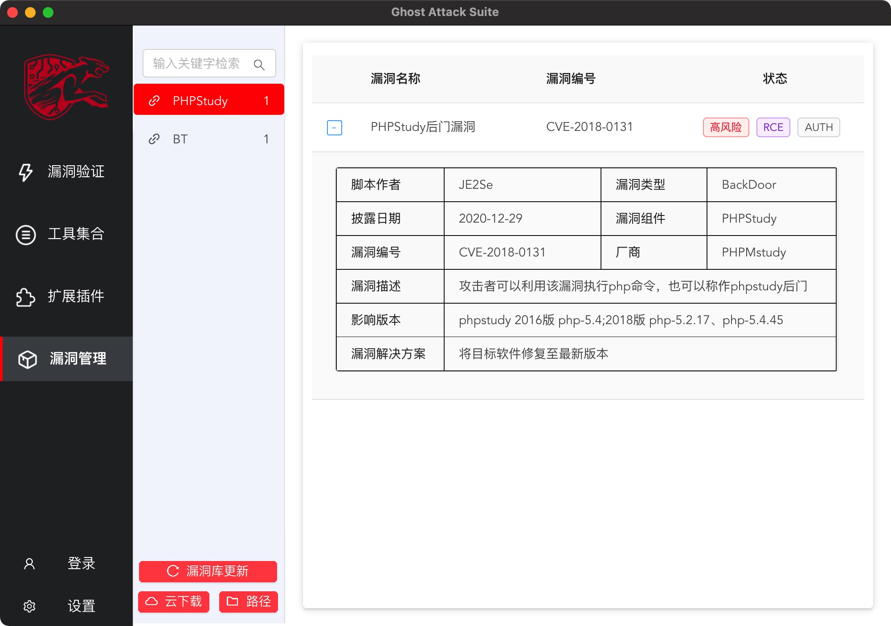

### [返回上层](../USE.md)
# 漏洞管理模块

漏洞管理模块主要负责漏洞更新以及集中展示，可自定义POC脚本集成到框架内。同时可联动VulDB进行云POC下载以及管理

提供了漏洞查询功能，漏洞展示功能，增加POC有两种途径 

1、使用云下载功能联动VulDB下载漏洞管理平台的POC；

2、使用本地编写POC本地加载POC

注意。新增加或者修改POC后需要点击漏洞库更新按钮进行数据更新，否则新POC将无法加载

### [返回上层](../USE.md)