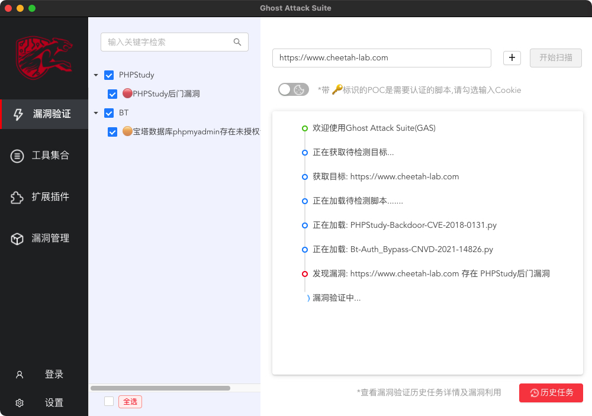
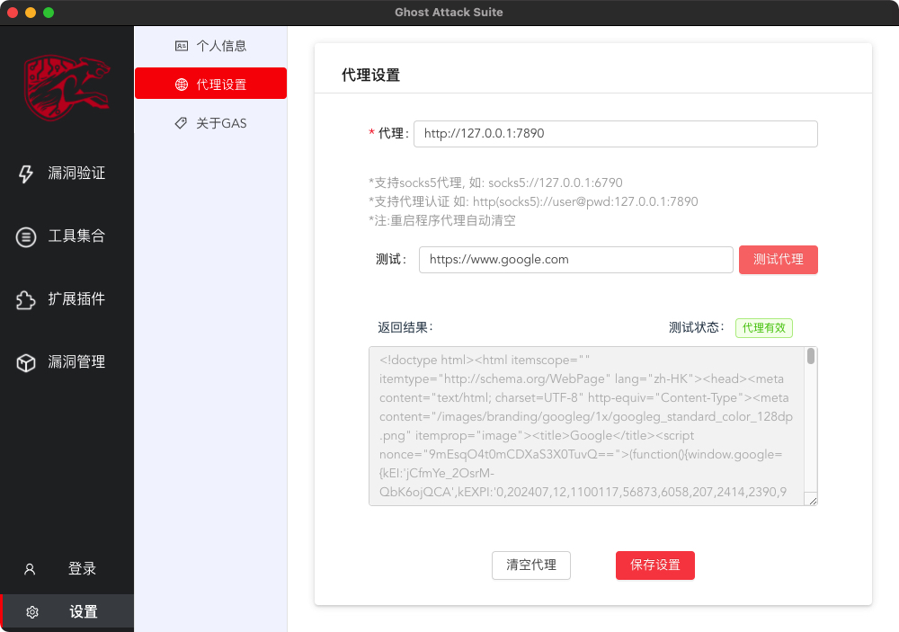
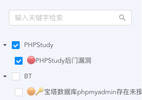
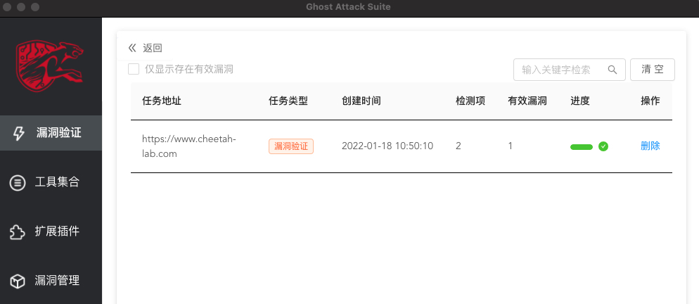
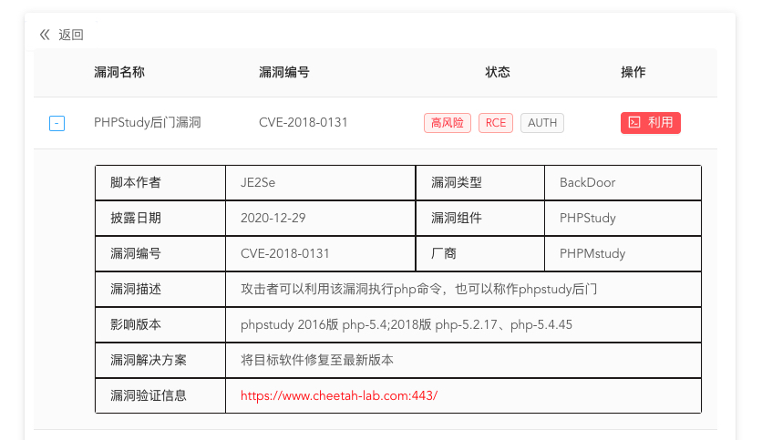
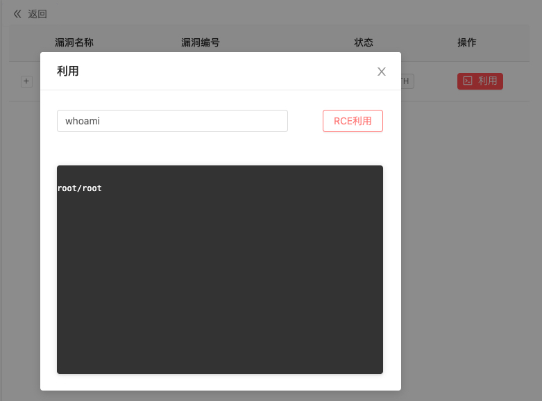

### [返回上层](../USE.md)
# 漏洞验证模块
模块主要由两部分组成，分别为左边的POC选择部分，以及右侧的扫描验证部分

对指定站点进行漏洞验证，首先在输入框输入待测的地址，在左侧选中待测的选项

工具支持批量检测，支持包含认证后的漏洞检测,工具还支持代理检测（注意：退出程序后代理会自动清空）

脚本选择界面，支持查询，支持全选，POC显示以树型图，POC上包含标识，🔴🟠🟢代表漏洞风险级别，🔑代表该POC是否需要认证，当包含🔑时，需要在扫描前点击cookie按钮添加cookie信息

查看或者漏洞利用请点击历史任务查看进程，里面包含本次扫描以及历史扫描信息，可进行关键词查询，也可进行筛选，如对为扫描出安全风险的任务进行排除显示

点击任务查看详情，详情内部显示漏洞相关信息，包含脚本类型信息，编号信息，影响范围，修复方案以及验证地址等等

如当前漏洞存在漏洞利用方式，可直接点击任务栏上的利用按钮进行利用,当前支持RCE漏洞，文件读取漏洞

### [返回上层](../USE.md)