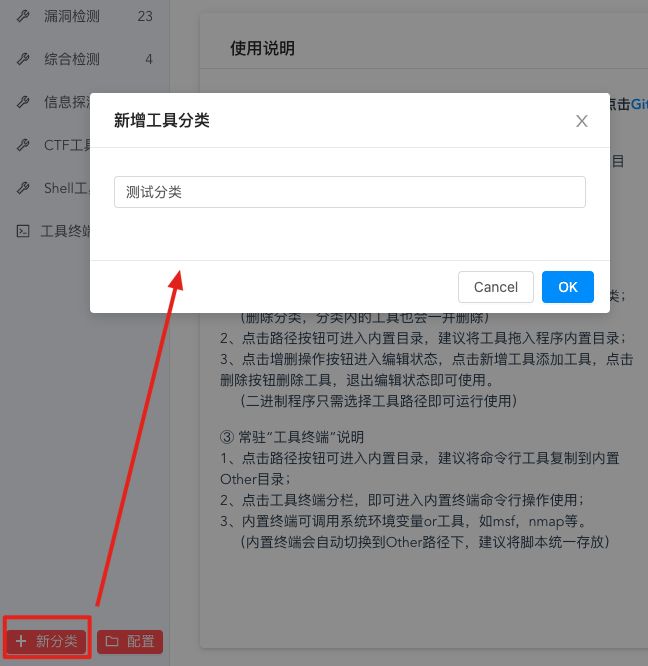
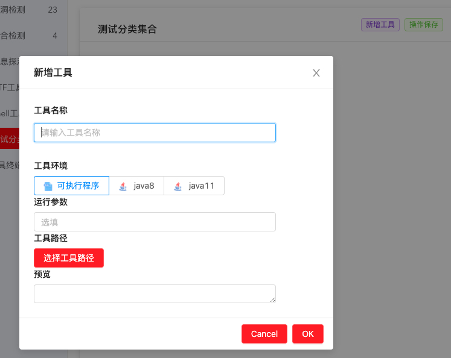

### [返回上层](../USE.md)

# 工具集合模块
⊙ 本工具支持二进制、Java程序运行（初始Java环境未安装，点击GitHub下载使用）
https://github.com/cheetah-lab/GAS_Extension_ENV

GhostAttackSuite（GAS）工具集合模块需要基础运营环境。按照软件运行系统环境，工具运行环境自行选择环境包下载！

如：当前系统为windows，有个java工具，java工具需要java8运行，那么选择下载的环境包为Java8_Macos.7z

现集成Linux，Windows，MacOS的JAVA环境，版本分别为Java8，Java11，其他环境补充中~

使用方法：运行软件 --> 点击工具集合 --> 点击二级菜单下方的配置按钮按钮跳转到工具目录 --> 解压下载环境压缩包解压到EnvPath目录 --> 自动加载

## 添加工具分类
点击新分类按钮，可添加新分类



点击查看详情，里面包含两个按钮，删除分类以及增删操作按钮


注意删除分类，分类内的工具也会一并删除，

点击增删操作按钮进入编辑状态，点击新增工具添加工具，点击删除按钮删除工具，退出编辑状态即可使用。注意二进制程序只需选择工具路径即可运行使用



按照相关填写要求填写数据即可，注意，添加或者删除工具后需要点击  操作保存标签，否则程序无法运行

### 添加技巧

#### 添加在MacOS 添加可添加APP程序
选中 可执行程序  标签  --->   运行参数 填写  ```open```  --->工具路径直接选择app即可

#### 添加在MacOS 添加可添加二进制程序
选中 可执行程序  标签  --->   运行参数 填写  ```不写```  --->工具路径直接选择二进制即可

#### 添加在MacOS 添加可添加java程序
选中 适合版本的java  标签  --->   运行参数 填写  ```-jar```  --->工具路径直接选择对应的JAR包即可

#### 添加在Windows 添加可添加EXE程序
选中 可执行程序  标签  --->   运行参数 填写  ```不写```  --->工具路径直接选择对应的EXE即可

#### 添加在Windows 添加可添加java程序
选中 适合版本的java  标签  --->   运行参数 填写  ```-jar```  --->工具路径直接选择对应的JAR包即可

#### 添加在通用环境下 添加可添加图形化界面的py脚本
选中 可执行程序  标签  --->   运行参数 填写  ```python3 ```  --->工具路径直接选择脚本程序即可即可

### [返回上层](../USE.md)